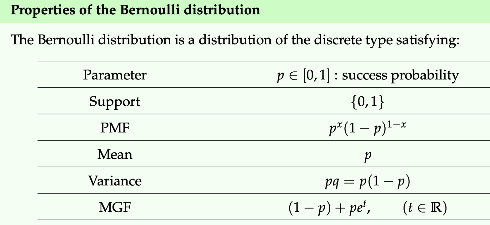
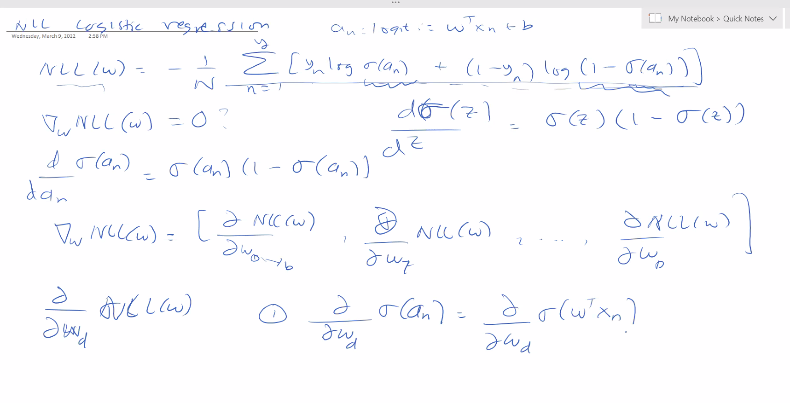
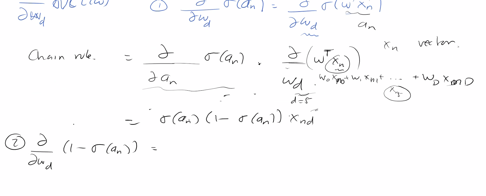
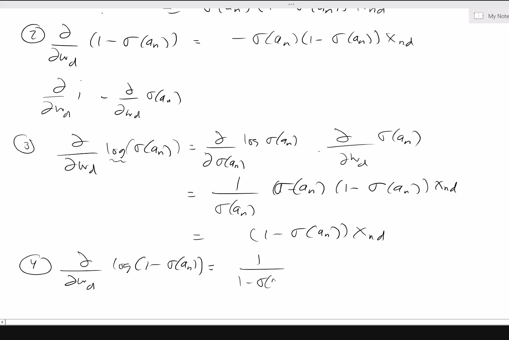
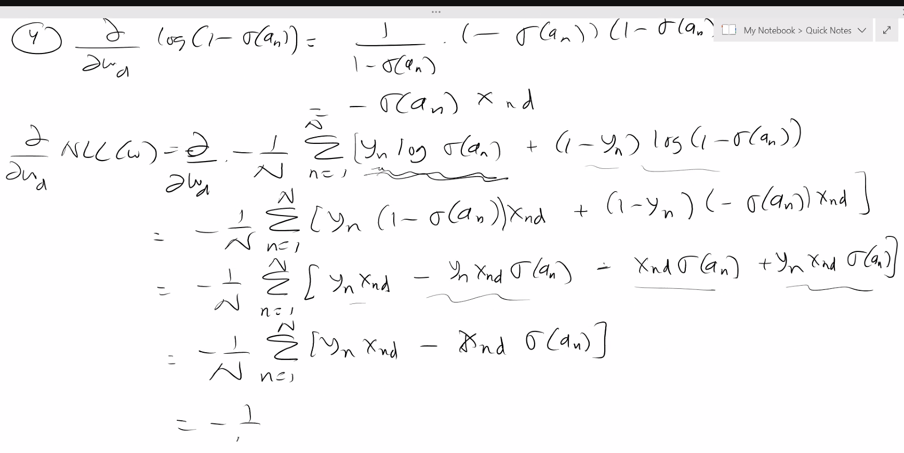
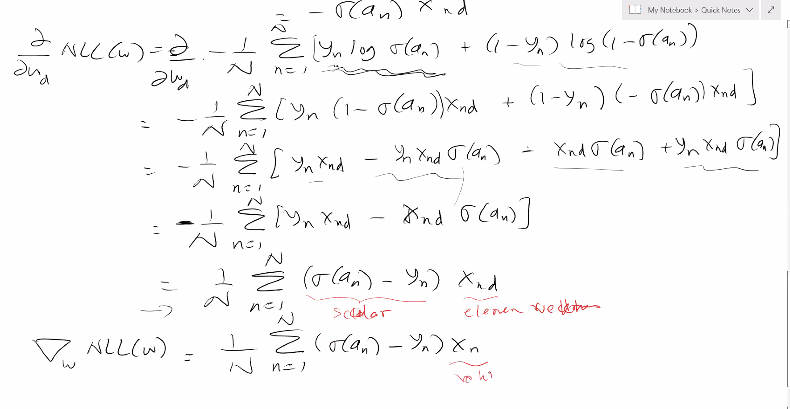
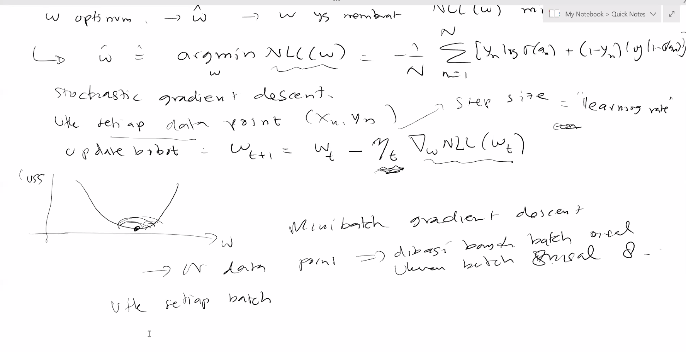
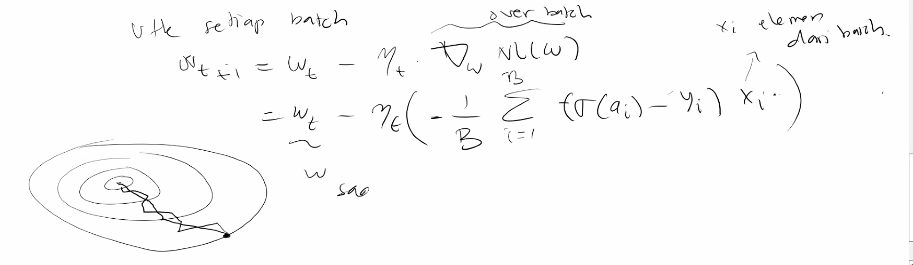

## Logistic Regression

Biasanya kalau fiturnya banyak intinya kita bakal menentukan sebuah plane yang bakal membagi space kita menjadi tepat dua buah half space.

Jika datanya linearly separable, maka kita bisa tentukan boundarynya sehingga regresinya sempurna. Cara melakukan regresinya sebenarnya kita hanya perlu liat apakah dia berada di sisi mana dari sebuah plane, apakah di atas atau di bawah. Secara formal bisa kita tulis sebagai:
$$
f(x) = \begin{cases}
1 \ \text{ if } w^Tx + b > 0\\
0 \ \text{otherwise}
\end{cases}
$$
Nah, $x$ itu fitur kita, dan $w$ sama $b$ itu parameter yang nantinya bakal kita optimisasi untuk ngelakuin klasifikasi.

Perhatikan bahwa benar $w^T(x - x_0) = 0$ Karena $w$ dan vektor $x-x_0$ itu perpendicular, alias tegak lurus,

Fungsi $\mathbb{I}$ function itu fungsi yang ngemap boolean ke integer, 0 dan 1. 1 true, 0 false.

Dalam kasus lain: Jika datanya tidak linearly separable, kita bisa menulis:
$$
f(x) = \mathbb{I}(p(y = 1| x) > p(y= 0 |x))
$$
Perhatikan bahwa fungsi tersebut bisa kita log kedua sisinya.

Bisa kita tuliskan lebih lanjut:
$$
\mathbb{I}(\log\frac{p(y = 1| x)}{p(y = 0|x)} > 0)
$$
Bila kita tulis secara harafiah, apabila log dari suatu event terjadi dibagi suatu event tidak terjadi itu lebih dari 1, atau lebih besar, maka dia lognya pasti akan besar dari 0.

Kita bisa tuliskan persamaan di atas tadi, bila kita sama kan si fungsi klasifikasi $f$nya. Definisikan $a=\boldsymbol{w}^{\boldsymbol{\top}} \boldsymbol{x}+b$ dan $t=p(y=1 \mid \boldsymbol{x})$ :
$$
\begin{aligned}
\boldsymbol{w}^{\boldsymbol{\top}} \boldsymbol{x}+b=\log \frac{p(y=1 \mid \boldsymbol{x})}{p(y=0 \mid \boldsymbol{x})} & \Leftrightarrow a=\log \frac{t}{1-t} \Leftrightarrow e^{a}=\frac{t}{1-t} \Leftrightarrow e^{a}-e^{a} t=t \\
& \Leftrightarrow t+e^{a} t=e^{a} \Leftrightarrow t=\frac{e^{a}}{1+e^{a}}
\end{aligned}
$$
Kita dapatkan kemungkinan classnya 1 $p(y=1 \mid \boldsymbol{x})$ adalah
$$
p(y=1 \mid \boldsymbol{x})=t=\frac{e^{a}}{1+e^{a}}=\frac{1}{1+e^{-a}}=\frac{1}{1+e^{-\left(\boldsymbol{w}^{\boldsymbol{\top}} \boldsymbol{x}+b\right)}}
$$
Persamaan tadi disebut binary regression

Bisa kita tulis kembali sebagai $\sigma(a)$, dengan $\sigma$ adalah fungsi sigmoid.

Perhatikan bahwa magnitude dari vektor $w$ nya yang menentukan kecuraman dari fungsi sigmoidnya,

NLL = negative log likelihood

IID = Independent and identically distributed random variables
$$
\begin{aligned}
\mathrm{NLL}(\boldsymbol{w}) &=-\frac{1}{N} \log p(\mathcal{D} \mid \boldsymbol{w})=-\frac{1}{N} \log \prod_{n=1}^{N} \operatorname{Ber}\left(y_{n} \mid \boldsymbol{\sigma}\left(a_{n}\right)\right) \\
&=-\frac{1}{N} \sum_{n=1}^{N} \log \left[\boldsymbol{\sigma}\left(a_{n}\right)^{y_{n}} \cdot\left(1-\boldsymbol{\sigma}\left(a_{n}\right)^{1-y_{n}}\right)\right] \\
&=-\frac{1}{N} \sum_{n}^{N}\left[y_{n} \log \boldsymbol{\sigma}\left(a_{n}\right)+\left(1-y_{n}\right) \log \left(1-\boldsymbol{\sigma}\left(a_{n}\right)\right)\right]=\frac{1}{N} \sum_{n}^{N} \mathbb{H}\left(y_{n}, \boldsymbol{\sigma}\left(a_{n}\right)\right)
\end{aligned}
$$

