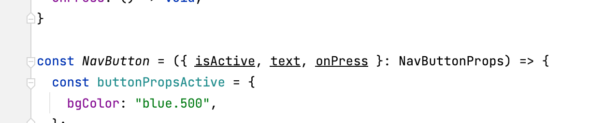
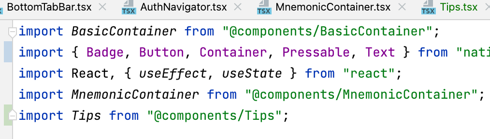
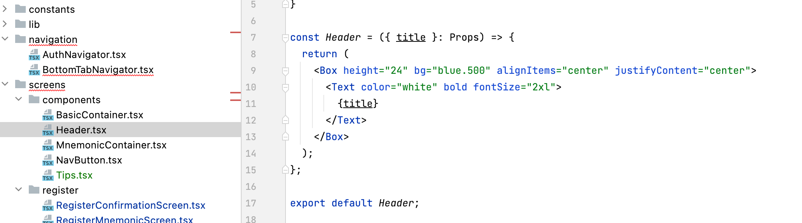
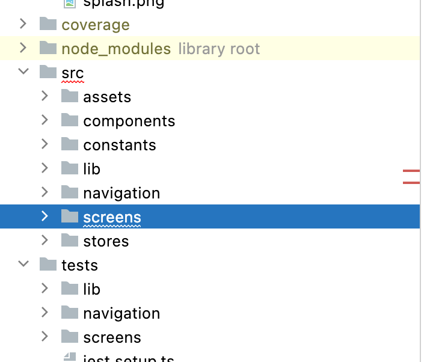

## Adapting it Into My Software Engineering Project

In my software engineering project, clean code is one of the biggest concern to work with a team 7 people. I can't do anything if I don't understand your code. So, I adapt several things.

### Setting Up Linter, Use Effective Typescript

> Lint, or a *linter*, is a static code analysis tool used to flag programming errors, bugs, stylistic errors and suspicious constructs.

In a project, linter is as important as your lunch, breakfast, and dinner. It can basically check whether you're doing is "Syntax"-ly normal. 



Setting a static typed variable in Typescript is really hard, as we can't really find the class name or the variable type properly if we don't understand the code! But typescript will help us to find errors when assigning something to a function, the linter can also automate the checking statically and live while we're typing.



The linter can also help tidy up the imports.

## The Library Stylesheet Pattern

When we're using a css props library like Tailwind or NativeBase, we don't really create StyleSheet.



Instead, the library encourage us to create components instead to reduce the clunked styles in each component. WIth this, it will be compact and the styling should be inline and easy to debug.

## Foldering



Foldering is also part of clean code. You don't want your code to be in one place because it will be hard for you the next time you want to search it.

## Setting Up Git Pre-commit Hooks

There is an app called husky, in which you set up to encourage the developer to pass the linter before commiting. This will encourage and force clean code throughout your codes.

## Testing in Jest

This is a good article to catch: https://markus.oberlehner.net/blog/naming-your-unit-tests-it-should-vs-given-when-then/

Testing in Jest is pretty cool, **test** and **it** is like a module of test (both of them are the same, it's basically just an alias) and **describe** is like the test class. We can do before each in a scope of one "describe". The test encourage us to do good naming of test! So cool

```js
describe('Given the balance is 1.000 €', () => {
  describe('When making a deposit of 100 €', () => {
    test('Then I expect the balance to be 1.100 €', () => {
      // ...
      expect(theBalance).toBe(1100);
    });
    it('Shoukd be error when I have no money', () => {
      // ...
    });
  });
});
```