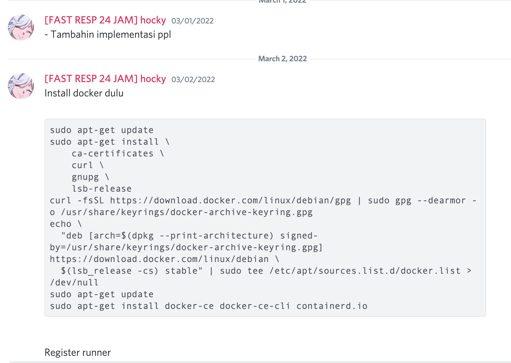
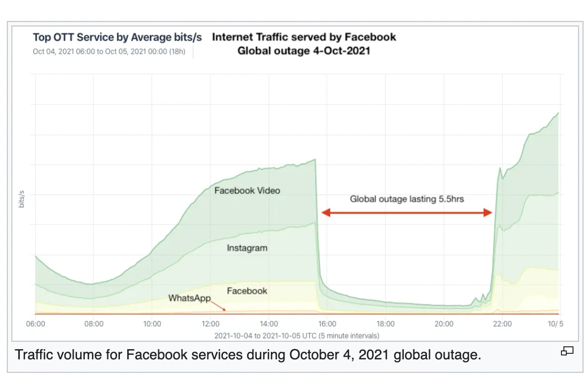

Software Architecture, Deployment, Capacity Planning, Error Handling, Backup

Refactoring

## In Every Release, I Should do A, B, and C. But I'm Lazy. What Should I Do?

The title of this post is like the longmost anime title already. But today I'm going to talk about Makefile, CI CD and some deployment utilities that can help you. I'm not going to talk about many things, but I hope this will help you

## CI/CD? Sounds Like Something Crispy

CI is basically an automation process. Something to evade this:

You're saving commands in your local chat because you're using it over and over again every deploy or iteration when committing. It's too long to type and you just want to copy paste everything 🤷‍♂️.

CD means continuous deployment, I think this refers to the condition where you want to update your application, but you really really want to avoid server maintenance that holds your user from using your service 🤔.

I'm not going straight to implementation and everything, just gonna give you some grasp on what I've learned on my software engineering project.

Big Servers never go down, but when it do everyone goes gangsta. Well, CD helps you to avoid this. Continuous deployment is basically every steps that you take to release or publish newer versions or updates while keeping your application down time is as little as possible. Of course, automation will always help.

That's why it's closely related to CI.

We already talked about git in the previous post. This cloud can be automated after we're pushing it into the repository. Let's see an example on how my project goes:

## Docker and Container, That Friendly Blue Whale 🐳

In a simple glasses, container is basically a whole new computer with a linux operating system. Which, you can put your code and run the commands in it. It's brand new, so it's not bloated and stuff. Docker is one of the most popular container engine.

In fact, there are some others docker tooling engine, but docker is the most wides one being used as the community is large and it has its own DockerHub where you can store **images**.

Images are not paintings. Images can be said to be a snapshot of an operating system condition.

## Images, Not that kind of Images!

What we're specifying is actually a bunch of `terminal bash scripts`, flavored in Linux Distribution (not cmd ones). In that case, we need an operating system to work on. Usually, we will use it depending on what programming language our products was written in.

Fox example when we're making a python application, we will use a `python:3.10` image. But in our projects, we're using react native, which is based on javascript. So we're using the `node:lts-alpine` here. `<ImagePreference>:<ReleaseVariation>`

 ## Stages, Steps

Next, we're gonna write stages, this is basically where you separate basics function on what you want to do. Here:

- We're going to run the tests first;
- then build the APK (we're creating android app);
- and lastly, we will check the code quality using a service called sonarqube.

In each stages, we can run the scripts. Because each step uses brand news so called "computer"—(it's called container, guys!).

Each stage contains scripts which will be ran sequentially! Now, downloading dependency can be quite difficult, so to not install it on every stage over and over again, we can cache it.

Then, we can run this on special branches only, or all branches except some,

